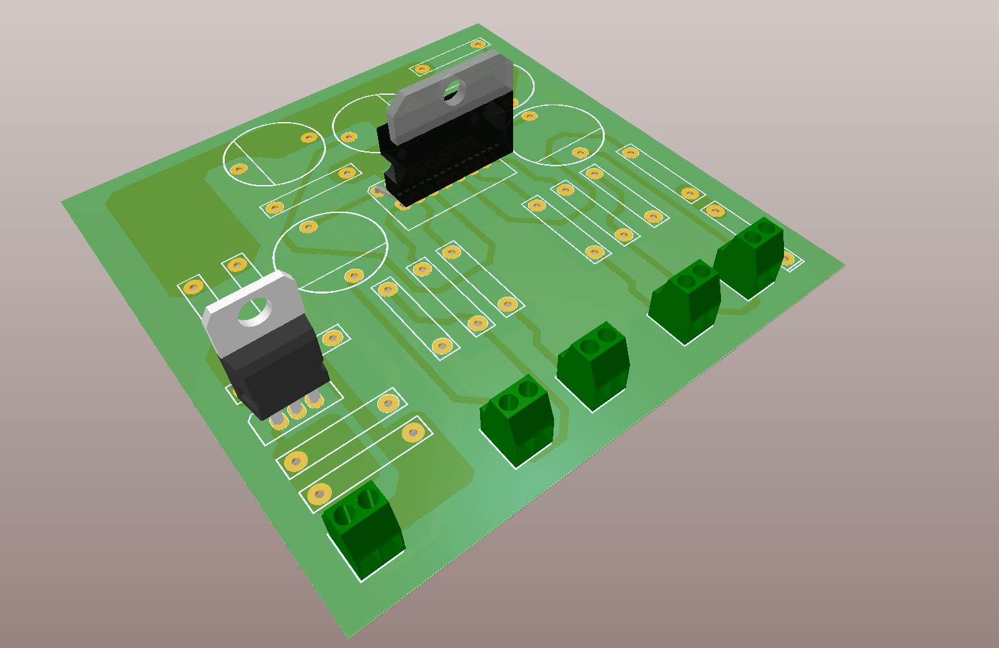

Audio Amplifier board
========================================================================================================================

This repository contains the Altium Designer files for an audio amplifier. This board is suitable for up to a pair of
input channels and up to four output channels.

Refer to the releases section for exported schematics, layouts and other files. 

